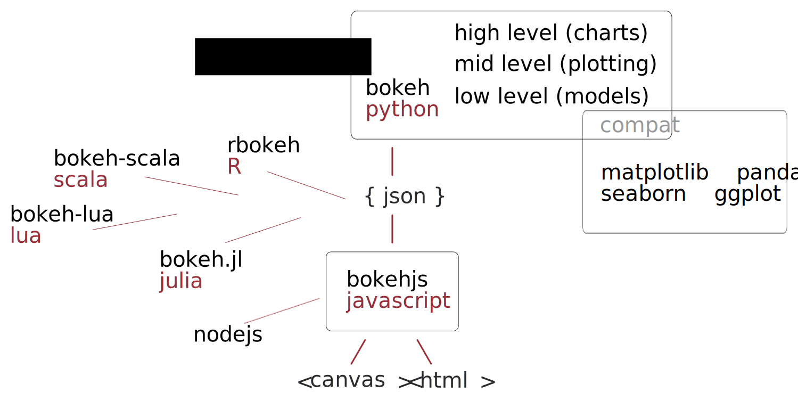
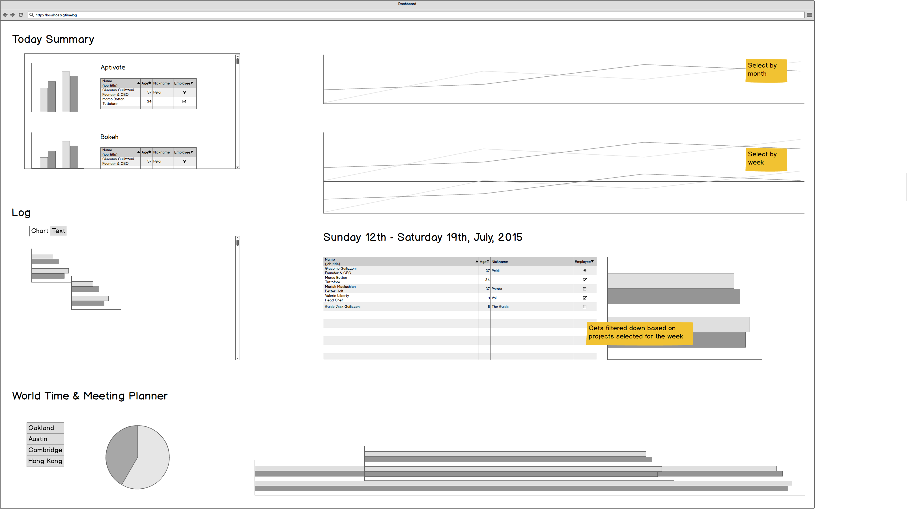
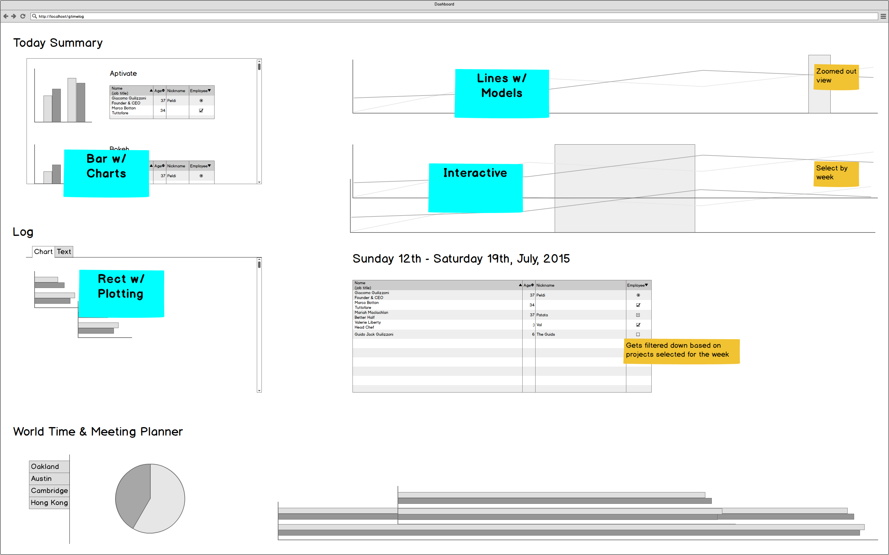
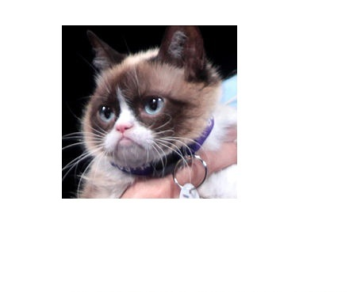

# Getting started with Bokeh 
Let's build an interactive data visualization for the web...

## in Python! 

#### Sarah Bird - Europython 2015


---
<a href="http://localhost:5000">Live demo....</a>


---

### app

github.com/birdsarah/gtimelog-viz

### slides

github.com/birdsarah/europython-2015-bokeh

### me

@birdsarah

---

# Bokeh


* data visualization library
 * d3.js & many more
 * matplotlib / seaborn
* web
* interactive
* dynamic & data-driven
* roots in data science

---

# Why bokeh?

from data science:

* interactive
* web - publishing & portability

from web dev:

* python vs javascript
* mid-sized data 1-10k | 10-100k

both:

* intuitive
* server-side processing & updating
* fully open-source

---


---


---



---



---



---


`conda install bokeh`

`pip install bokeh`

****
optional

`conda install ipython-notebook pandas`

`pip install "ipython[notebook]" pandas`


---

## bokeh.models (high customization)


* The lowest level
* Offers you the most control
* Do all the work yourself

<p></p>

## bokeh.plotting

* Tries to pick sensible defaults
* You organize your data, it organizes your plot
<p></p>

## bokeh.charts (high speed)

* One-line charts
* Processes your data & spits out a chart

---

* data
* io
* charts 
* plotting 
* models 
* layout
* embedding
* styling
* interactive

.... and there's more in a couple of hours - Fabio Pliger's talk.
---

Data.....



Spend at least half of my time getting data in the right shape.
---

At the heart of Bokeh is the `ColumnDataSource`

| 'column of xs' | 'column of ys'
|---|---
|0|1 
|1|2
|3|4

and the `Plot`

```python
from bokeh.models import Plot
p = Plot
```
```python
from bokeh.plotting import figure
p = figure()
```
```python
from bokeh.plotting import Chart
p = Chart()
```
They're all the same thing with the same methods / attributes on them.
---

Let's get started with a chart:
http://localhost:888

---

Which one should I pick?

* Making your website - models
* Poking data - charts
* More complex poking or presenting to colleagues - plotting

They're all the same thing though

---

# Further reading

* User guide - [bokeh.pydata.org/en/latest/docs/user_guide.html](http://bokeh.pydata.org/en/latest/docs/user_guide.html)
* Tutorial notebooks - [github.com/bokeh/bokeh-notebooks/tutorial](http://github.com/bokeh/bokeh-notebooks/tutorial)

---

